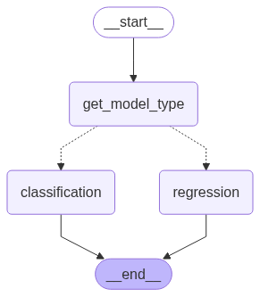

# ML Model Tuning Assistant

This AI Agent, powered by LangGraph and Streamlit, assists data scientists and machine learning practitioners in improving their models. By analyzing model metrics, it provides actionable suggestions for tuning both classification and regression models.


## 📖 Table of Contents

[✨ Features](#-features)<br>
[🚀 Getting Started](#-getting-started)<br>
[Requirements](#requirements)<br>
[Installation](#how-to-run)<br>
[📁 Project Structure](#-project-structure)<br>
[Demonstration](#demonstration)<br>
[📄 License](#-license)<br>
[About](#about)

## ✨ Features

* **Model Type Selection:** Routes the user's request to the correct LLM prompt based on whether they are working with a classification or regression model.
* **Actionable Suggestions:** Provides a summary of how to improve your model in the form of concise, actionable bullet points.
* **Intuitive User Interface:** A simple and clean Streamlit app that makes it easy to input your metrics and get a response.

## 🚀 Getting Started

Follow these steps to get a copy of the project up and running on your local machine.

## Requirements

* Python 3.8 or higher
* Google API key for the Gemini model
* `langchain` >= 0.3.27
* `langchain-community` >= 0.3.27
* `langchain-openai` >= 0.3.30
* `langgraph` >= 0.6.5
* `openai` >= 1.99.9
* `langchain-google-genai` >= 2.1.9
* `feature-engine` >= 1.8.3
* `scikit-learn` >= 1.7.1
* `seaborn` >= 0.13.2
* `streamlit` >= 1.48.1
* `scikit-optimize` >= 0.10.2

## How to Run

### 1. Clone the repository

```bash
git clone https://github.com/gurezende/ML-Tuning-Assistant.git
cd your-repo-name
```

### 2. Install the required packages

```python
pip install -r <package_name>
```

### 3. Run the Agent

Run the Streamlit application from the terminal:

```bash
streamlit run main.py
```

3.1. Open your browser and navigate to the local URL provided by Streamlit.<br>
3.2. Enter your Google API key in the sidebar.<br>
3.3. Add your model's metrics in the text area and hit `Enter` on your keyboard. The more details you provide (e.g., accuracy, precision, recall, F1-score for classification; RMSE, MAE, R² for regression), the better the suggestions will be. <br>
3.4. Follow the on-screen prompts to specify your model type and receive tuning suggestions.

## 📁 Project Structure

* `main.py`: The main Streamlit application file.
* `graph.py`: Defines the LangGraph flow, including the state and nodes.
* `nodes.py`: Contains the individual functions (nodes) used in the LangGraph, including the LLM prompts and Streamlit input handler.
* `pyproject.toml`: Lists the Python dependencies.

## Demonstration

<table>
  <tr>
    <td width="50%"></td>
    <td width="50%"></td>
  </tr>
</table>

## 📄 License

This project is licensed under the MIT License.

## About

This project was developed by Gustavo R Santos.

Find me online: https://gustavorsantos.me